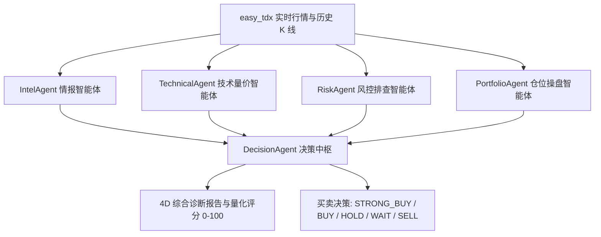

# 📘 StockQuant 深度使用与投研开发指南 (User Guide)

本文档面向希望深入掌握 **StockQuant** 投研平台操作、通达信高速数据接入 (`easy_tdx`)、多智能体 AI 投研 (`daily_stock_analysis`)、48 套量化战法选股、因子工程与自定义策略编写的量化研究员与个人投资者。

---

## 目录
1. [环境配置与虚拟环境安装指南 (venv)](#1-环境配置与虚拟环境安装指南-venv)
2. [底层数据引擎接入说明 (easy_tdx 原生直连)](#2-底层数据引擎接入说明-easy_tdx-原生直连)
3. [工作台核心功能图解操作指南](#3-工作台核心功能图解操作指南)
   - [3.1 大盘全景看板 (Dashboard)](#31-大盘全景看板-dashboard)
   - [3.2 连板天梯与短线接力 (Limit Up Ladder)](#32-连板天梯与短线接力-limit-up-ladder)
   - [3.3 异动雷达与偏离值预警 (Abnormal Moves)](#33-异动雷达与偏离值预警-abnormal-moves)
   - [3.4 48 大策略选股中心 (Screener)](#34-48-大策略选股中心-screener)
   - [3.5 真实回测工作台 (Backtest Station)](#35-真实回测工作台-backtest-station)
   - [3.6 AI 4D 多智能体深度诊股与大盘复盘 (AI Review)](#36-ai-4d-多智能体深度诊股与大盘复盘-ai-review)
   - [3.7 AI 量化投研对话助理 (AI Chat)](#37-ai-量化投研对话助理-ai-chat)
   - [3.8 股票搜索与拼音首字母自动补全 (Stock Autocomplete)](#38-股票搜索与拼音首字母自动补全-stock-autocomplete)
   - [3.9 easy_tdx 服务器管理、并发测速与热切换 (Server Management)](#39-easy_tdx-服务器管理并发测速与热切换-server-management)
4. [48 套量化策略全景速查表 (含 15 大 daily_stock_analysis 战法)](#4-48-套量化策略全景速查表-含-15-大-daily_stock_analysis-战法)
5. [多智能体 AI 投研架构与 4D 诊股逻辑](#5-多智能体-ai-投研架构与-4d-诊股逻辑)
6. [自定义策略极简开发指南 (10行代码写策略)](#6-自定义策略极简开发指南-10行代码写策略)
7. [自动化测试与 API 接口参考](#7-自动化测试与-api-接口参考)
8. [常见问题排查与高级配置](#8-常见问题排查与高级配置)

---

## 1. 环境配置与虚拟环境安装指南 (venv)

在首次运行前，请确认系统已安装 64 位的 Python 3.10 ~ 3.14 环境。

### 1.1 创建与激活 Python `venv` 虚拟环境

为防止不同项目的包版本冲突，本项目严格推荐使用独立虚拟环境：

#### Windows PowerShell:
```powershell
# 1. 进入 stock_quant 项目根目录
cd c:\Users\aaron\Documents\stock_data\stock_quant

# 2. 创建虚拟环境 .venv
python -m venv .venv

# 3. 激活虚拟环境
.\.venv\Scripts\activate
```

#### Linux / macOS:
```bash
cd stock_quant
python3 -m venv .venv
source .venv/bin/activate
```

### 1.2 安装依赖库与本地 `easy_tdx` 驱动

在激活的虚拟环境中，执行一键依赖安装：

```bash
pip install -r requirements.txt
```

> **说明**：`requirements.txt` 中已声明 `-e ../easy_tdx`，将自动以可编辑模式挂载本地高并发 `easy_tdx` 原生驱动，同时**完全摒弃 `pytdx`**。

---

## 2. 底层数据引擎接入说明 (easy_tdx 原生直连)

StockQuant 彻底移除了传统的 `pytdx` 依赖，全面升级由本地自研的高性能通达信二进制协议库 `easy_tdx` 驱动：

- **原生 TCP 二进制协议**：启动后内置连接池 `TDXConnectionPool`，自动并发测速并连接全国数十个官方主站（如武汉、上海、深圳电信/联通主站）。
- **多市场全面覆盖**：完美支持沪市 (`Market.SH`)、深市 (`Market.SZ`) 及北交所 (`Market.BJ`) 全品种证券。
- **全周期 K 线支持**：精准映射 `KlineCategory.MIN_1` (1分钟), `MIN_5` (5分钟), `MIN_15`, `MIN_30`, `MIN_60`, `DAY` (日线), `WEEK` (周线), `MONTH` (月线) 等。
- **本地数据可选挂载**：支持直接读取通达信客户端本地 `vipdoc/` 历史盘后日线与分钟文件，进一步提升历史回测与全截面选股效率。

---

启动系统并访问 Web 工作台：

```powershell
# 默认启动 (端口 8000，并自动为您打开浏览器)
python run.py

# 指定端口启动 (如 8900 端口)
python run.py --port 8900

# 常用参数一览
python run.py --help
#   --port, -p 8900      指定 Web 监听端口 (默认: 8000)
#   --host 0.0.0.0       指定监听地址 (默认: 0.0.0.0)
#   --no-browser         启动后不自动唤起浏览器
#   --reload             开启开发热重载模式
#   --tdx-host <IP>      指定直连通达信行情节点 IP
```
在现代浏览器（Chrome / Edge / Safari）中打开 `http://localhost:8000/`（或您指定的端口如 `http://localhost:8900/`）：

### 3.1 大盘全景看板 (Dashboard)
- **情绪温度计 (0~100)**：直观量化当前市场赚钱效应。
  - `0~25` (冰点期)：建议左侧低吸龙头底仓。
  - `25~45` (启动期)：积极试错首板与 1进2 标的。
  - `45~75` (主升期)：顺势重仓主线龙头。
  - `75~85` (高潮期)：分批逢高止盈，不宜盲目追高。
  - `85~100` 或 `<40` 快速退潮：空仓防守或轻仓套利。
- **全市场涨跌分布**：10 档收益率直方图，清晰展现多空对抗力量。
- **行业主线轮动榜**：按主力资金净流入与涨跌幅实时排序。
- **easy_tdx 实时行情池**：展示核心监控标的的股票代码、股票名称、最新价、涨跌幅、日内高低点与形态标签。

### 3.2 连板天梯与短线接力 (Limit Up Ladder)
- **连板高度梯队**：清晰呈现 5连板、4连板、3连板、2连板及首板阵列。
- **真实封单与题材归属**：展示股票代码、股票名称、封单金额（如 5.8 亿元）及领涨核心概念。
- **晋级成功率监控**：辅助短线打板与 1进2 接力博弈决策。

### 3.3 异动雷达与偏离值预警 (Abnormal Moves)
- **集合竞价超预期 (9:15~9:25)**：自动捕捉昨日烂板但今日竞价大幅高开抢筹的“弱转强”黑马（包含代码与名称）。
- **盘中即时异动**：实时推送 5 分钟急涨、大单连续主买与放量突破日内高点个股。
- **交易所偏离值合规监控**：针对主板 3日 20%、创业板/科创板 3日 30% 监管红线，实时计算偏离值接近度（如已达 92.5%），预警潜在停牌与问询风险。

### 3.4 48 大策略选股中心 (Screener)
1. 在顶部下拉框中动态选择需要执行的策略（涵盖 33 套基础策略与 15 套 `daily_stock_analysis` 经典战法）。
2. 点击 **【一键选股】** 按钮。
3. 毫秒级完成全市场扫描，在表格中清晰输出**股票代码**、**股票名称**、最新价格、成交量与信号日期。
4. 点击每行末尾的 **【载入回测】**，可直接将该标的送入回测工作台进行历史全周期验证！

### 3.5 真实回测工作台 (Backtest Station)
1. 在股票输入框中输入代码（如 `000001`）、拼音首字母（如 `payh`）或名称（如 `平安银行`），下拉联想列表将即时弹出匹配结果。
2. 选择待回测策略与初始资金（默认 100,000 元）。
3. 按回车或点击 **【开始回测】**：
   - 顶部显示：`当前标的：000001 平安银行 · 策略：均线多头排列 (bull_trend)`。
   - 实时生成**资金净值曲线**与**标的价格走势对照图**（包含策略净值与基准买入持有）。
   - 实时动态计算输出 6 大指标：**累计收益率**、**年化收益率**、**最大回撤**、**夏普比率**、**胜率**及**盈亏比**。
   - 展开展示该标的最近 10 笔买卖交易流水（成交价格、数量、税费、单笔盈亏与盈亏比例）。

### 3.6 AI 4D 多智能体深度诊股与大盘复盘 (AI Review)
- **每日盘后复盘研报**：由 `MarketReviewer` 自动化生成宏观、情绪周期、主线题材与次日操作策略指引。
- **个股 4D 深度量化诊断**：
  - 支持拼音首字母/代码/名称自动补全。
  - **4D 雷达图**：技术面、基本面、资金面、情绪面、风控安全 5 维量化打分。
  - **综合评分与操作信号**：输出 `000001 平安银行` 综合量化评分 (0~100) 及明确买卖建议（`STRONG_BUY`, `BUY`, `HOLD`, `WAIT`, `SELL`）。
  - **五大智能体分析卡片**：展开 Intel, Technical, Risk, Portfolio 各智能体的详细论据与移动止损位。
- **15 大经典策略匹配清单**：实时评估该股票在 15 套 `daily_stock_analysis` 策略下的触发与匹配状态。

### 3.7 AI 量化投研对话助理 (AI Chat)
- 在对话框中输入任意投研问题（如：“000001 平安银行 目前符合哪些策略？”、“如何为海康威视设置动态移动止损？”），AI 助手将结合多智能体与严进策略知识库进行实时解答。

### 3.8 股票搜索与拼音首字母自动补全 (Stock Autocomplete)
- **全格式支持**：
  - **拼音首字母**：如输入 `payh` 自动联想 `000001 平安银行`，输入 `gzmt` 联想 `600519 贵州茅台`，输入 `bjjz` 联想 `300223 北京君正`。
  - **股票代码**：输入任意 6 位代码或前缀（如 `0024` 或 `300750`）。
  - **中文名称**：输入如 `宁德`、`茅台`、`银行` 等关键词。
- **即时响应**：内置本地高频股票词典 + 腾讯 Smartbox 毫秒级在线补全引擎，覆盖全市场 5000+ A 股与 ETF 基金。
- **全界面展示代码与名称**：所有选股、回测、诊股、天梯与异动模块均同时展示【股票代码】与【股票名称】。

### 3.9 easy_tdx 服务器管理、并发测速与热切换 (Server Management)
- **点击顶部状态栏**：点击顶部导航栏右上角的 `easy_tdx 直连正常 (xx ms)` 徽标，即可弹出【行情服务器管理与测速控制台】。
- **一键并发测速**：点击 **【并发测速全部节点】**，后台通过多线程并发对全国 50+ 个通达信官方与核心主站进行 TCP 延迟 Ping 检测，并按毫秒数自动升序排列。
- **一键热切换**：点击任意服务器右侧的 **【切换此节点】**，无需重启服务即可即刻完成 TCP 连接池重连与无缝切换。
- **自动最优连接**：点击 **【自动连接最优节点】**，系统将自动测速并绑定当前延迟最低的极速主站。

---

## 4. 48 套量化策略全景速查表 (含 15 大 daily_stock_analysis 战法)

| 策略标识 (ID) | 策略中文名 | 归属类别 | 策略核心逻辑简要说明 |
| :--- | :--- | :--- | :--- |
| **bottom_volume** | 底部放量反转 | daily_analysis | 经历长阴下跌后出现底部放量阳线或锤头线，捕捉反转第一波起爆点 |
| **box_oscillation** | 箱体震荡高抛低吸 | daily_analysis | 运用箱体阶段支撑位低吸，触及箱体顶部位高抛 |
| **bull_trend** | 均线多头排列 | daily_analysis | MA5 > MA10 > MA20 多头排列，顺势回踩 5日/10日 均线低吸 |
| **chan_theory_daily** | 缠论笔买卖点 | daily_analysis | 基于缠论 K 线包含处理、顶底分型与笔划分，在底分型确认或一笔回调结束点进场 |
| **dragon_head_momentum** | 龙头战法接力 | daily_analysis | 强势涨停板后缩量回踩 MA5 或强势接力连板突破，捕捉超额连板溢价 |
| **emotion_cycle_daily** | 情绪周期状态机 | daily_analysis | 识别市场冰点转暖、主升与分歧阶段，顺应赚钱效应进行波段配置 |
| **event_driven** | 事件催化驱动 | daily_analysis | 借助重组、定增、重大利好或政策红利事件，突破日内或阶段性平台买入 |
| **expectation_repricing** | 预期差重估 | daily_analysis | 业绩大幅超预期或突发利好带来的估值重估跳空突破战法 |
| **growth_quality** | 高成长质量白马 | daily_analysis | 结合 ROE、利润增速等基本面指标与中长期均线趋势进场 |
| **hot_theme_resonance** | 热点题材板块共振 | daily_analysis | 识别领涨行业主线，在板块指数大涨时跟进板块内高弹性先锋标的 |
| **ma_golden_cross_daily** | 经典均线金叉 | daily_analysis | 5日均线上穿 10日/20日 均线形成金叉，成交量同步放大 |
| **one_yang_three_yin** | 一阳吞三阴反包 | daily_analysis | 连续缩量调整 3~5 日后，突发大阳线吞没前期阴线实体，强势反包进场 |
| **shrink_pullback** | 缩量回踩强支撑 | daily_analysis | 多头趋势中缩量回踩 MA5/MA10 支撑线且不破位，提供安全边际低吸点 |
| **volume_breakout_platform** | 放量平台突破 | daily_analysis | 长期横盘整理后，单日成交量超过 5日均量 2 倍以上并长阳突破平台阻力 |
| **wave_theory_impulse** | 波浪理论主升浪 | daily_analysis | 识别第 2 浪调整结束点，在第 3 浪主升浪确认突破时重仓进场 |
| *(其余 33 套基础策略)* | 双均线/MACD/KDJ/布林带/海龟/ERP等 | technical / short_term / factor / macro | 涵盖经典技术指标、动量短线、Alpha 因子分层与宏观择时策略 |

---

## 5. 多智能体 AI 投研架构与 4D 诊股逻辑

StockQuant 的 AI 模块位于 `src/stock_quant/ai/`，由以下分工明确的智能体协同工作：



- **`IntelAgent` (情报智能体)**：新闻舆情情感倾向分析、题材催化强度评估。
- **`TechnicalAgent` (技术量价智能体)**：计算 MA5/10/20/60 趋势、量比、MACD/RSI/KDJ 及支撑阻力位。
- **`RiskAgent` (风控合规智能体)**：排查 ST 风险、股东减持、股权质押、均线破位及追高乖离率预警。
- **`PortfolioAgent` (仓位与操盘智能体)**：基于波动率自适应计算建议仓位，根据 ATR 计算移动止损价与目标止盈价。
- **`DecisionAgent` (决策中枢)**：综合四大智能体得分输出最终 4D 评分与信号。
- **`StrategyAgent` (策略匹配智能体)**：全量回测 15 套经典战法并输出命中标签。
- **`MarketReviewer` (每日大盘复盘)**：自动化撰写机构级大盘复盘报告。

---

## 6. 自定义策略极简开发指南 (10行代码写策略)

在 `src/stock_quant/strategies/` 对应子目录下新建 Python 文件：

```python
import pandas as pd
from stock_quant.strategies.base import BaseStrategy
from stock_quant.strategies.registry import register_strategy
from stock_quant.indicators.mytt import MA, CROSS

@register_strategy
class MyCustomStrategy(BaseStrategy):
    name = "my_custom_strategy"
    display_name = "我的自定义均线金叉策略"
    category = "technical"
    description = "MA5 上穿 MA30 买入，下穿卖出"
    params_schema = {"fast_p": 5, "slow_p": 30}

    def generate_signals(self, df: pd.DataFrame) -> pd.DataFrame:
        res = df.copy()
        fast_p = int(self.params.get("fast_p", 5))
        slow_p = int(self.params.get("slow_p", 30))
        
        ma_fast = MA(res["close"], fast_p)
        ma_slow = MA(res["close"], slow_p)
        
        # 必须输出 boolean 类型的 buy_signal 与 sell_signal
        res["buy_signal"] = CROSS(ma_fast, ma_slow)
        res["sell_signal"] = CROSS(ma_slow, ma_fast)
        return res
```

> **特性**：只需使用 `@register_strategy` 装饰器，保存后系统将**全自动注册该策略**，并立即在前端选股、回测与 API 列表中展现！

---

## 7. 自动化测试与 API 接口参考

### 7.1 运行自动化测试套件

在虚拟环境中使用 `pytest` 执行全套单元与集成测试：

```powershell
# 1. 运行核心组件集成测试（涵盖 48 套策略、easy_tdx 与 AI 智能体）
.\.venv\Scripts\pytest.exe tests\test_all_components.py -v

# 2. 运行后端 API 接口测试
.\.venv\Scripts\pytest.exe tests\test_api_endpoints.py -v

# 3. 运行股票拼音搜索与服务器测速管理测试
.\.venv\Scripts\pytest.exe tests\test_server_and_stocks.py -v
```

### 7.2 常用后端 API 接口一览

| 请求路径 | 方法 | 功能说明 |
| :--- | :---: | :--- |
| `/api/health` | GET | 服务健康检查 |
| `/api/stocks/search?q={query}` | GET | 股票代码、拼音首字母（如 `payh`）、中文名称自动补全 |
| `/api/stocks/info/{symbol}` | GET | 获取个股代码、中文名称与格式化标题 |
| `/api/server/hosts` | GET | 列出所有已知 TDX 服务器与当前激活节点 |
| `/api/server/test` | POST | 并发测速所有 TDX 服务器并返回排序列表 |
| `/api/server/switch` | POST | 热重连并切换当前活跃 TDX 服务器 |
| `/api/strategies/` | GET | 获取全量 48 套注册策略列表与元数据 |
| `/api/screener/scan?strategy={id}` | GET/POST | 全市场策略选股扫描 |
| `/api/backtest/run?symbol={sym}&strategy={id}` | GET/POST | 执行历史策略 T+1 回测 |
| `/api/ai/daily_review` | GET | 获取当日 AI 机构级大盘复盘报告 |
| `/api/ai/stock_diagnosis/{symbol}` | GET | 获取个股 4D 多智能体深度诊断结果与评分 |
| `/api/ai/strategy_match/{symbol}` | GET | 获取个股在 15 大经典战法中的匹配度与状态 |
| `/api/ai/chat` | POST | 与 AI 量化投研助理进行智能对话 |

---

## 8. 常见问题排查与高级配置

### 8.1 修改服务端口
在 [`src/stock_quant/config.py`](src/stock_quant/config.py) 中修改：
```python
API_PORT: int = 8888  # 将端口修改为您希望使用的端口
```

### 8.2 配置大模型 API 密钥 (LLM)
在 `src/stock_quant/config.py` 或环境变量中设置您的 API 密钥（支持 DeepSeek / 通义千问 / OpenAI / Claude / Ollama）：
```python
LLM_PROVIDER: str = "deepseek"  # "deepseek", "qwen", "openai", "claude", "ollama"
LLM_API_KEY: str = "sk-xxxxxxxxxxxxxxxxxxxxxxxx"
```

### 8.3 交易费率微调
系统默认回测费率设置：
- 印花税：`0.0005` (千分之0.5，仅卖出收取)
- 券商佣金：`0.0003` (万分之3，双向收取，最低 5 元)
- 滑点：`0.001` (千分之1)
可在 `config.py` 中根据实盘账户费率自由调整。

---

祝您在量化投资与智能投研之路上一帆风顺，持续斩获超额收益！
