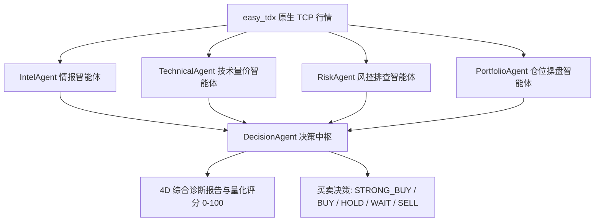

# 📘 easy_tdx 全功能量化投研与多智能体监控平台使用指南 (User Guide)

本文档面向使用 **easy_tdx** 进行通达信原生 TCP 直连、48 套量化策略选股、T+1 真实回测、AI 多智能体 4D 诊股、每日盘后复盘、短线连板天梯与异动偏离值监控的量化研究员与交易者。

---

## 目录
1. [快速启动指南](#1-快速启动指南)
2. [底层数据引擎接入说明 (easy_tdx 原生直连)](#2-底层数据引擎接入说明-easy_tdx-原生直连)
3. [工作台核心功能图解操作指南](#3-工作台核心功能图解操作指南)
   - [3.1 大盘全景看板 (Dashboard)](#31-大盘全景看板-dashboard)
   - [3.2 连板天梯与短线接力 (Limit Up Ladder)](#32-连板天梯与短线接力-limit-up-ladder)
   - [3.3 异动雷达与偏离值合规预警 (Abnormal Radar)](#33-异动雷达与偏离值合规预警-abnormal-radar)
   - [3.4 48 大策略选股中心 (Screener)](#34-48-大策略选股中心-screener)
   - [3.5 真实回测工作台 (Backtest Station)](#35-真实回测工作台-backtest-station)
   - [3.6 AI 4D 多智能体深度诊股与大盘复盘 (AI Review)](#36-ai-4d-多智能体深度诊股与大盘复盘-ai-review)
   - [3.7 AI 量化投研对话助理 (AI Chat)](#37-ai-量化投研对话助理-ai-chat)
   - [3.8 股票搜索与拼音首字母自动补全 (Stock Autocomplete)](#38-股票搜索与拼音首字母自动补全-stock-autocomplete)
   - [3.9 easy_tdx 服务器管理、并发测速与热切换 (Server Management)](#39-easy_tdx-服务器管理并发测速与热切换-server-management)
4. [48 套量化策略全景速查表 (含 15 大 daily_stock_analysis 战法)](#4-48-套量化策略全景速查表-含-15-大-daily_stock_analysis-战法)
5. [多智能体 AI 投研架构与 4D 诊股逻辑](#5-多智能体-ai-投研架构与-4d-诊股逻辑)
6. [自动化测试与 API 接口参考](#6-自动化测试与-api-接口参考)

---

## 1. 快速启动指南

在 `c:\Users\aaron\Documents\stock_data\easy_tdx` 目录下：

```powershell
# 1. 启动全功能服务（默认端口 8000）
python run.py
```

在现代浏览器中打开 **`http://localhost:8000/`** 即可进入全新量化工作台！

---

## 2. 底层数据引擎接入说明 (easy_tdx 原生直连)

- **原生 TCP 二进制通信**：内置全国数十个通达信官方主站地址，开箱即用，无需第三方中间件。
- **全周期 K 线与实时行情**：支持日线、周线、月线、1分钟、5分钟、15分钟、分笔 Tick 及五档买卖盘口。
- **扩展市场与缠论支持**：完美支持全 A 股、北交所、ETF 基金、期货及完整缠论笔与中枢分析。

---

## 3. 工作台核心功能图解操作指南

### 3.1 大盘全景看板 (Dashboard)
- **情绪温度计 (0~100)**：量化当前市场赚钱效应（冰点、启动、主升、高潮、退潮）。
- **全市场涨跌分布**：10 档收益率直方图，清晰展现多空力量对比。
- **行业主线轮动榜**：按主力资金净流入与涨跌幅实时排序。
- **实时行情池**：展示核心监控标的的最新价、涨跌幅、日内高低点与形态标签。

### 3.2 连板天梯与短线接力 (Limit Up Ladder)
- **连板高度梯队**：清晰呈现 5连板、4连板、3连板、2连板及首板阵列。
- **真实封单与题材归属**：展示股票代码、股票名称、封单金额（如 5.8 亿元）及领涨概念。

### 3.3 异动雷达与偏离值合规预警 (Abnormal Radar)
- **集合竞价超预期 (9:15~9:25)**：自动捕捉昨日烂板但今日竞价大幅高开抢筹的“弱转强”黑马。
- **盘中即时异动**：实时推送 5 分钟急涨、大单连续主买与放量突破日内高点个股。
- **交易所偏离值合规监控**：针对主板 3日 20%、创业板 3日 30% 监管红线，实时计算偏离值接近度（如 92.5%）。

### 3.4 48 大策略选股中心 (Screener)
- 在顶部下拉框中动态选择需要执行的策略（涵盖 33 套基础策略与 15 套 `daily_stock_analysis` 经典战法）。
- 点击 **【一键选股】** 按钮，毫秒级完成全市场扫描，输出股票代码与股票名称。
- 点击 **【载入回测】** 可直接送入回测工作台。

### 3.5 真实回测工作台 (Backtest Station)
- 输入代码（如 `000001`）、拼音首字母（如 `payh`）或名称（如 `平安银行`）。
- 实时生成**策略资金净值曲线**与**标的买入持有走势对照图**。
- 输出**累计收益率**、**年化收益率**、**最大回撤**、**夏普比率**、**胜率**及**盈亏比** 6 大指标与交易流水。

### 3.6 AI 4D 多智能体深度诊股与大盘复盘 (AI Review)
- **每日盘后复盘研报**：自动化生成宏观、情绪周期、主线题材与次日操作策略指引。
- **个股 4D 深度量化诊断**：展开 Intel, Technical, Risk, Portfolio 各智能体的详细论据与移动止损位。
- **15 大经典策略匹配清单**：实时评估该股票在 15 套经典战法下的触发与匹配状态。

### 3.7 AI 量化投研对话助理 (AI Chat)
- 在对话框中输入任意投研问题，AI 助手将结合多智能体与严进策略知识库进行实时解答。

### 3.8 股票搜索与拼音首字母自动补全 (Stock Autocomplete)
- 输入如 `payh` 自动联想 `000001 平安银行`，输入 `gzmt` 联想 `600519 贵州茅台`，输入 `bjjz` 联想 `300223 北京君正`。
- 所有表格和卡片全面展示【股票代码】与【股票名称】。

### 3.9 easy_tdx 服务器管理、并发测速与热切换 (Server Management)
- 点击顶部右上角的 `easy_tdx 直连正常 (xx ms)` 徽标，弹出【行情服务器管理控制台】。
- 点击 **【并发测速全部节点】**，对全国 50+ 个主站进行 TCP Ping 测速并升序排列。
- 点击 **【切换此节点】** 即刻热重连并切换；点击 **【自动连接最优节点】** 绑定延迟最低的主站。

---

## 4. 48 套量化策略全景速查表 (含 15 大 daily_stock_analysis 战法)

| 策略标识 (ID) | 策略中文名 | 归属类别 | 策略核心逻辑简要说明 |
| :--- | :--- | :--- | :--- |
| **bottom_volume** | 底部放量反转 | daily_analysis | 经历长阴下跌后出现底部放量阳线或锤头线，捕捉反转第一波起爆点 |
| **box_oscillation** | 箱体震荡高抛低吸 | daily_analysis | 运用箱体阶段支撑位低吸，触及箱体顶部位高抛 |
| **bull_trend** | 均线多头排列 | daily_analysis | MA5 > MA10 > MA20 多头排列，顺势回踩 5日/10日 均线低吸 |
| **chan_theory_daily** | 缠论笔买卖点 | daily_analysis | 基于缠论 K 线包含处理、顶底分型与笔划分，在底分型确认或一笔回调结束点进场 |
| **dragon_head_momentum** | 龙头战法接力 | daily_analysis | 强势涨停板后缩量回踩 MA5 或强势接力连板突破，捕捉超额连板溢价 |
| **emotion_cycle_daily** | 情绪周期状态机 | daily_analysis | 识别市场冰点转暖、主升与分歧阶段，顺应赚钱效应进行波段配置 |
| **event_driven** | 事件催化驱动 | daily_analysis | 借助重组、定增、重大利好或政策红利事件，突破日内或阶段性平台买入 |
| **expectation_repricing** | 预期差重估 | daily_analysis | 业绩大幅超预期或突发利好带来的估值重估跳空突破战法 |
| **growth_quality** | 高成长质量白马 | daily_analysis | 结合 ROE、利润增速等基本面指标与中长期均线趋势进场 |
| **hot_theme_resonance** | 热点题材板块共振 | daily_analysis | 识别领涨行业主线，在板块指数大涨时跟进板块内高弹性先锋标的 |
| **ma_golden_cross_daily** | 经典均线金叉 | daily_analysis | 5日均线上穿 10日/20日 均线形成金叉，成交量同步放大 |
| **one_yang_three_yin** | 一阳吞三阴反包 | daily_analysis | 连续缩量调整 3~5 日后，突发大阳线吞没前期阴线实体，强势反包进场 |
| **shrink_pullback** | 缩量回踩强支撑 | daily_analysis | 多头趋势中缩量回踩 MA5/MA10 支撑线且不破位，提供安全边际低吸点 |
| **volume_breakout_platform** | 放量平台突破 | daily_analysis | 长期横盘整理后，单日成交量超过 5日均量 2 倍以上并长阳突破平台阻力 |
| **wave_theory_impulse** | 波浪理论主升浪 | daily_analysis | 识别第 2 浪调整结束点，在第 3 浪主升浪确认突破时重仓进场 |
| *(其余 33 套基础策略)* | 双均线/MACD/KDJ/布林带/海龟/ERP等 | technical / short_term / factor / macro | 涵盖经典技术指标、动量短线、Alpha 因子分层与宏观择时策略 |

---

## 5. 多智能体 AI 投研架构与 4D 诊股逻辑



---

## 6. 自动化测试与 API 接口参考

运行全量组件与 API 测试：
```powershell
python -m pytest tests/test_all_quant_components.py tests/test_quant_api_endpoints.py -v
```

### 常用 API 接口：
- `GET /api/health` - 服务健康检查
- `GET /api/stocks/search?q={query}` - 股票拼音/代码自动联想
- `GET /api/stocks/info/{symbol}` - 股票名称解析
- `GET /api/server/hosts` - 获取 TDX 服务器列表
- `POST /api/server/test` - 并发测速
- `POST /api/server/switch` - 热切换服务器
- `GET /api/screener/scan?strategy={id}` - 48 大策略一键选股
- `GET /api/backtest/run?symbol={sym}&strategy={id}` - T+1 策略回测
- `GET /api/ai/daily_review` - 每日盘后复盘报告
- `GET /api/ai/stock_diagnosis/{symbol}` - 4D 多智能体诊股
- `GET /api/ai/strategy_match/{symbol}` - 15 大经典策略匹配状态
- `POST /api/ai/chat` - AI 投研助理对话
