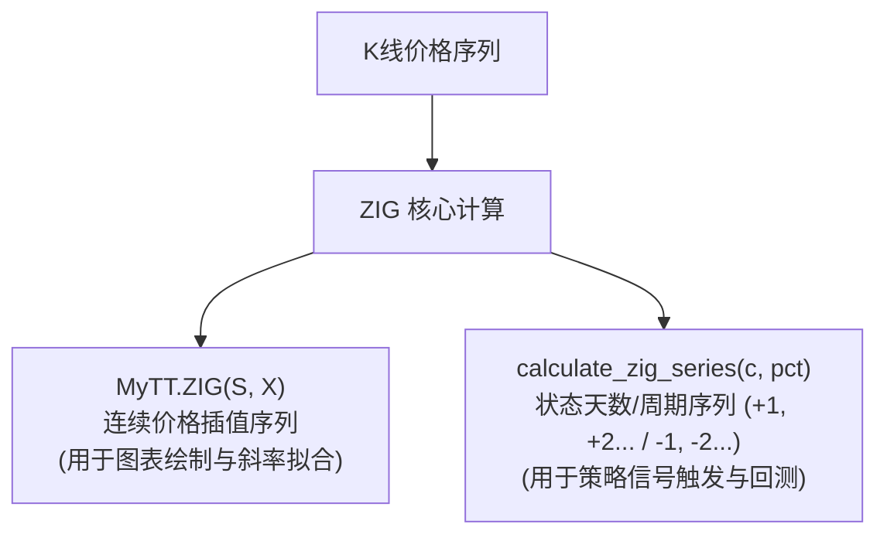
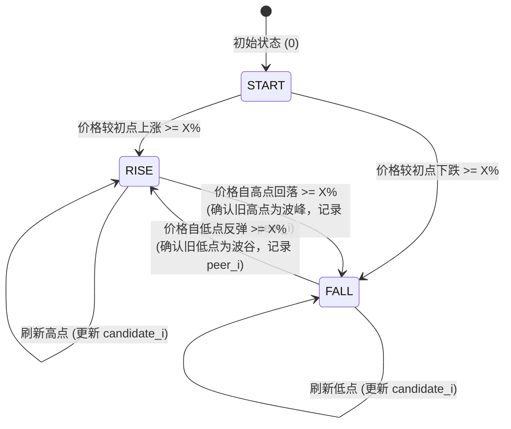
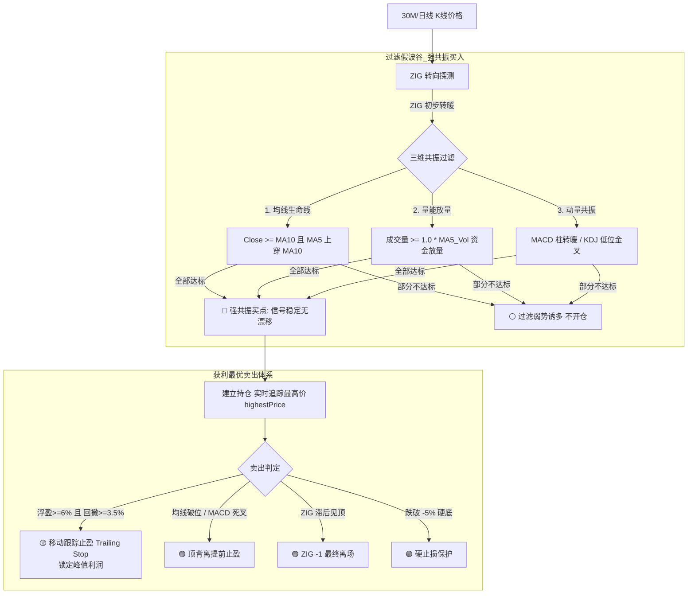

# 通达信 ZIG (之字转向) 算法完全指南与量化实战体系

> **文档版本**：v1.0  
> **适用模块**：`easy_tdx.MyTT.ZIG`、`easy_tdx.trading_system.engine.calculate_zig_series`、`easy_tdx.strategies.technical.zig_breakout`  
> **配套工具**：`easy_tdx.tests.unit.test_zig_analysis`

---

## 目录
1. [ZIG 指标核心定义与基本原理](#一-zig-指标核心定义与基本原理)
2. [两大核心算法数学模型与代码实现](#二-两大核心算法数学模型与代码实现)
   - [算法一：经典通达信价格插值序列 `MyTT.ZIG(S, X)`](#1-算法一经典通达信价格插值序列-myttzigs-x)
   - [算法二：状态天数/周期序列 `calculate_zig_series(close, change_pct)`](#2-算法二状态天数周期序列-calculate_zig_seriesclose-change_pct)
3. [“未来函数”特性与量化应对策略](#三-未来函数特性与量化应对策略)
4. [四维多指标共振与获利最优增强体系](#四-四维多指标共振与获利最优增强体系)
5. [经典实盘复盘：金牛化工（600722）30分钟反转全推演](#五-经典实盘复盘金牛化工60072230分钟反转全推演)
6. [配套分析工具使用指南 (CLI & 单元测试)](#六-配套分析工具使用指南-cli--单元测试)

---

## 一、 ZIG 指标核心定义与基本原理

### 1. 什么是 ZIG？
**ZIG (ZigZag / 之字转向指标)** 是一种通过过滤微小价格波动（市场噪声）、仅连接主要波峰（Peak）与波谷（Trough）的经典趋势跟踪与波浪划分指标。

### 2. 核心数学判定规则
设定反转阈值比例 $X\%$（例如 $5\%$ 或 $10\%$）：
- **波峰转向下跌**：当价格自波谷持续上涨后，最新价格从此前达到的**最高极值点下跌幅度超过 $X\%$**，则正式确立前最高点为**有效波峰**，趋势转向下跌；
- **波谷转向上涨**：当价格自波峰持续下跌后，最新价格从此前达到的**最低极值点反弹幅度超过 $X\%$**，则正式确立前最低点为**有效波谷**，趋势转向上涨。

$$
\text{波峰确认条件：} \quad \frac{P_{\text{peak}} - P_{\text{current}}}{P_{\text{peak}}} \ge X\%
$$

$$
\text{波谷确认条件：} \quad \frac{P_{\text{current}} - P_{\text{trough}}}{P_{\text{trough}}} \ge X\%
$$

---

## 二、 两大核心算法数学模型与代码实现

在 `easy_tdx` 框架中，ZIG 体系根据用途拆分为两个核心实现：



---

### 1. 算法一：经典通达信价格插值序列 `MyTT.ZIG(S, X)`

#### 功能与输出
* **位置**：`easy_tdx.MyTT.ZIG`
* **输入**：价格序列 $S$（通常为收盘价 `CLOSE`）、转向阈值 $X$（支持百分数如 $5.0$ 或小数如 $0.05$）
* **输出**：与 $S$ 等长的拟合插值数组（浮点价格），两拐点之间采用线性插值平滑连接。

#### 状态机流转逻辑


#### 核心代码实现片段
```python
def ZIG(S, X=35):
    S = np.asarray(S, dtype=float)
    n = len(S)
    if n <= 1:
        return S.copy()

    x = float(X) / 100.0 if float(X) > 1.0 else float(X)
    ZIG_STATE_START, ZIG_STATE_RISE, ZIG_STATE_FALL = 0, 1, 2

    peer_i = 0
    candidate_i = None
    peers = [0]
    state = ZIG_STATE_START

    for scan_i in range(1, n):
        # 扫描并动态更新极值点与转向
        if state == ZIG_STATE_RISE:
            if S[scan_i] >= S[candidate_i]:
                candidate_i = scan_i
            elif S[scan_i] <= S[candidate_i] * (1.0 - x):
                peer_i = candidate_i
                peers.append(peer_i)
                state = ZIG_STATE_FALL
                candidate_i = scan_i
        elif state == ZIG_STATE_FALL:
            if S[scan_i] <= S[candidate_i]:
                candidate_i = scan_i
            elif S[scan_i] >= S[candidate_i] * (1.0 + x):
                peer_i = candidate_i
                peers.append(peer_i)
                state = ZIG_STATE_RISE
                candidate_i = scan_i
        ...

    # 拐点间线性插值 (Linear Interpolation)
    z = np.zeros(n, dtype=float)
    for i in range(len(clean_peers) - 1):
        p_start, p_end = clean_peers[i], clean_peers[i + 1]
        slope = (S[p_end] - S[p_start]) / (p_end - p_start)
        for j in range(p_end - p_start + 1):
            z[p_start + j] = S[p_start] + slope * j
    return RD(z)
```

---

### 2. 算法二：状态天数/周期序列 `calculate_zig_series(close, change_pct)`

#### 功能与输出
* **位置**：`easy_tdx.trading_system.engine.calculate_zig_series`
* **语义**：
  * **正数（$+1, +2, +3 \dots$）**：表示当前处于**波谷反转向上推进趋势**中，$+1$ 为底部反转确立的首根 K 线；
  * **负数（$-1, -2, -3 \dots$）**：表示当前处于**波峰见顶向下调整趋势**中，$-1$ 为顶部反转确立的首根 K 线；
  * 数值绝对值代表自拐点确认以来持续运行的周期数（天数或 K 线根数）。

#### 通达信未来函数即时端点特性
通达信原生 ZIG 在实盘最前端具有**即时端点反馈**机制：当价格达到当前波段极值且末端出现微小反向折返时，系统会即时投影当前极值为临时拐点。`calculate_zig_series` 完整实现了该端点对齐逻辑：
```python
# 末端未确认波段的即时极值拐点处理
if trend == 1:
    if last_pivot_idx < n - 1 and close[-1] < last_pivot_price:
        all_pivots.append((last_pivot_idx, last_pivot_price, 1))
elif trend == -1:
    if last_pivot_idx < n - 1 and close[-1] > last_pivot_price:
        all_pivots.append((last_pivot_idx, last_pivot_price, -1))
```

---

## 三、 “未来函数”特性与量化应对策略

### 1. 为什么说 ZIG 是“未来函数”？
在历史 K 线数据中回溯时，ZIG 生成的拐点精准无误地标记在波谷的**最低价当天**。然而在**实盘逐日推进**时：
* 在最低点当天，算法**并不知道**这是最低点；
* 必须等到价格从最低点**反弹达到 $X\%$ 之后的那一根 K 线**，算法才“恍然大悟”并将前方的最低点确认为有效波谷；
* 这导致波谷点在历史图表上被“追溯画出”，这正是未来函数的典型表现。

### 2. 实盘中的两大核心痛点
1. **买卖点漂移（假波谷反复被套）**：在弱势阴跌通道中，价格偶尔反弹达到临界值诱发临时拐点，但次日继续低开破位，导致前一日的买点被抹去推翻；
2. **获利无法最优（见顶卖出大幅回吐）**：纯 ZIG 策略必须等价格从最高点跌落满 $X\%$ 才会触发卖点。如果个股冲高 $+20\%$，跌落 $10\%$ 才卖出，白白吐回一半利润。

---

## 四、 四维多指标共振与获利最优增强体系

为了彻底克服未来函数的漂移缺陷并锁定峰值利润，`easy_tdx` 引入了**四维多指标复合共振体系**：



### 核心参数建议表

| 维度 | 参数名称 | 默认建议值 | 作用与原理 |
| :--- | :--- | :---: | :--- |
| **ZIG 转向** | `zig_delta` | `5.0%` (30M) / `10.0%` (日线) | 基础波段划分幅度，兼顾灵敏度与抗噪 |
| **右侧突破** | `confirm_pct` | `1.0%` | 收盘价突破前 20 周期阻力位 `HHV20` 超过该比例时追涨回补 |
| **生命线** | `use_ma_filter` | `True` (MA10/MA20) | 杜绝空头熊市逆势接飞刀 |
| **主力成交量** | `use_vol_filter`| `True` (量比 ≥ 1.0) | 拒绝无量弱反弹 |
| **移动跟踪止盈** | `trail_trigger_pct`<br>`trail_callback_pct` | `6.0%`<br>`3.5%` | 浮盈达 6% 后开启最高点回撤 3.5% 止盈，**解决利润大幅回吐** |
| **硬止损兜底** | `stop_loss_pct` | `3.0% ~ 5.0%` | 单笔交易最大容忍亏损下限 |

---

## 五、 经典实盘复盘：金牛化工（600722）30分钟反转全推演

以 **金牛化工（600722）2026年7月16日至7月20日** 的 30分钟 K 线真实行情推演：

```text
2026-07-16 15:00 (序号 152): 收盘 7.75 元 (探出波谷低点, ZIG 序列处于 -142 深度探底)
2026-07-17 10:00 (序号 153): 收盘 8.53 元 (首板涨停, 反弹幅度 (8.53-7.75)/7.75 = +10.06%, 序列跳变为 +1)
2026-07-17 15:00 (序号 160): 收盘 8.53 元 (一字涨停封死, 序列递增至 +8)
2026-07-20 10:00 (序号 161): 开盘 9.17 元, 最高 9.38 元, 收盘 9.38 元 (二板涨停, 序列推进至 +9)
```

### 为什么在 7月20日 10:00 判定为确定性反转信号？
1. **大级别转向阈值彻底确认**：
   * 7月17日首板涨幅为 $+10.06\%$，对于 $15\%$ 或 $20\%$ 阈值的稳健大级别模型尚属“待确认阶段”；
   * 7月20日 10:00 冲上 9.38 元，累计自低点反弹幅度为：
     $$\frac{9.38 - 7.75}{7.75} = +21.03\%$$
   * 彻底击穿 $15\%$ 和 $20\%$ 大级别防伪阈值，将 7.75 元永久锁固为历史大底波谷。
2. **右侧阻力位突破回补（Breakout）**：
   * 7月20日 10:00 前 20 根 30 分钟 K 线最高价阻力位为 **8.53 元**；
   * 7月20日 10:00 直接跳空高开至 9.17 元并封死 9.38 元，突破幅度高达 **$+9.96\%$**，触发强力右侧突破买入。
3. **成交量 8 倍巨资抢筹**：
   * 7月20日 10:00 该 30 分钟成交量达 **46,735,300 股**（成交额 4.26 亿元），相较此前 10 根 K 线均量（580 万股）放大 **8.05 倍**，确认主力资金真金白银建仓。

---

## 六、 配套分析工具使用指南 (CLI & 单元测试)

所有分析与测试逻辑已整合至：
📁 [tests/unit/test_zig_analysis.py](file:///c:/Users/aaron/Documents/stock_data/easy_tdx/tests/unit/test_zig_analysis.py)

### 1. 命令行参数速查表

```bash
python tests/unit/test_zig_analysis.py [OPTIONS]
```

| 参数选项 | 全称 | 默认值 | 示例 / 说明 |
| :--- | :--- | :---: | :--- |
| `-s`, `--symbol` | 股票代码或名称 | `600722` | 支持 `600722`、`600722.SH` 或 `金牛化工`、`贵州茅台` |
| `-p`, `--period` | K线周期类型 | `30M` | 可选 `5M`, `15M`, `30M`, `60M`, `DAY`, `WEEK`, `MONTH` |
| `-e`, `--end-date` | 分析截至日期 | `2026-07-20` | 可选 `YYYY-MM-DD` 或带时间 `YYYY-MM-DD HH:MM:SS` |
| `-d`, `--days` | 回溯自然日天数 | `30` | 默认统计截至日期前 1 个月的数据 |
| `-t`, `--threshold`| ZIG 转向幅度 | `5.0,10.0` | 支持多个阈值并行对比（逗号分隔） |
| `--no-table` | 省略明细大表 | `False` | 仅输出末端信号诊断与突破分析摘要 |

### 2. 常用操作范式

#### ① 分析金牛化工 30分钟 K线并输出完整 168 根明细表
```bash
python tests/unit/test_zig_analysis.py --symbol 600722 --period 30M --end-date 2026-07-20
```

#### ② 诊断任意股票日线级别反转（快速摘要模式）
```bash
python tests/unit/test_zig_analysis.py --symbol 贵州茅台 --period DAY --end-date 2026-07-20 --no-table
```

#### ③ 执行自动化测试套件
```bash
pytest tests/unit/test_zig_analysis.py -v
```
*(用例涵盖：命令行解析验证、代码名称双向映射、周期自动归一化、实际行情拉取与 ZIG 极值断言)*
